### Первая задача

#### Пример с выводом хеша по алгоритму MD5.
```python
import cProfile
import hashlib
cProfile.run("hashlib.md5(b'Pasya Vankov' * 1000000).hexdigest()")
```
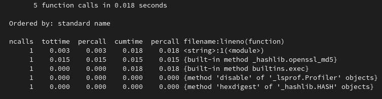

Как мы можем заметить большее время выполнение происходит с самой функцией хеширования(_hashlib.openssl_md5), это происходит в общем из-за того что это фактически единственная функция в этом коде. Также можно заметить что второй по времезатратности является < string >: 1(module), что логично учитывая, огромность всей строки участвующей в операции.

#### Пример с использованием регулярного выражения.
```python
import cProfile
import re

r = re.compile("\\d\\S")
cProfile.run("""[r.findall("sdfdsfD, 1d, 7f") for i in range(1000000)]""")
```

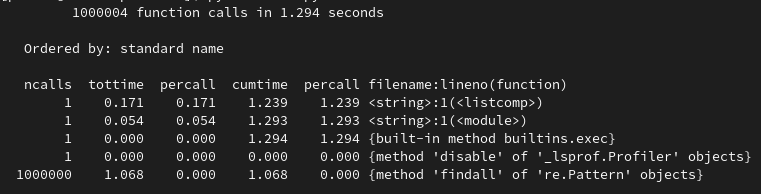

Сам поиск занимает, больше всего времени, но и вызывается больше всего раз, если же учитывать времезатратность за 1 вызов операции, то внутренние одиночные операции со строками выполняются дольше чем одна операция поиска с помощью регулярного выражения.

#### Первая циклическая задача из ЛР 1-4.
```python
import cProfile
cProfile.run("""
def main():
    y = int(input("Введите количество строк\\n"))
    if 50 < y or y < 12:
        print("При таких значениях я не могу работать нормально")
        raise ValueError
    x = y * 2
    Even = True
    if y % 2 == 1:
        Even = False
    if (x // 6) % 2 == 1:
        x += 1
    center = y // 2 - 1
    has_text = (x * 11 // 18) >= 22
    texts = ["CODE THE WORLD", "www.itmathrepetitor.ru"]
    template_str = "[" * ((x * 5) // 12 + (1 if Even else 0)) + " " * (x // 12)
    template_str_small = "[" + template_str[1:x // 4 - 2].replace("[", ":") + "["  #
    template_str_small += " " * (len(template_str) - len(template_str_small))
    print(template_str + "".join(reversed(template_str)).replace("[", "]"))
    for line in range(1, y - 1):
        if line < y // 6 or line > y - 1 - y // 6:
            string = "[" + template_str[1:].replace("[", ":")
        elif line == y // 6 or line == y - 1 - y // 6:
            template_str_copy = list(template_str)
            template_str_copy[template_str.rfind("[")] = ":"
            template_str_copy = "".join(template_str_copy)
            string = "[" + template_str[1: x // 4 - 1].replace("[", ":") + template_str_copy[
                                                                           x // 4 - 1:]
        else:
            if line == center and has_text:
                string = template_str_small[:(len(template_str_small) - len(texts[0]) // 2)]
                print(string + texts[0] + "".join(reversed(string)).replace("[", "]"))
                continue
            elif line == center + 1 and has_text:
                string = template_str_small[:(len(template_str_small) - len(texts[1]) // 2)]
                print(string + texts[1] + "".join(reversed(string)).replace("[", "]"))
                continue
            else:
                string = template_str_small
        print(string + "".join(reversed(string)).replace("[", "]"))
    print(template_str + "".join(reversed(template_str)).replace("[", "]"))


if __name__ == '__main__':
    cycle_do = True
    while cycle_do:
        try:
            main()
            cycle_do = False
            input()
        except ValueError:
            import os
            import time

            for i in range(12):
                os.system('cls' if os.name == 'nt' else 'clear')
                print("ОШИБКА!!! НАЧИНАЮ ПЕРЕЗАГРУЗКУ" + "." * (i % 3 + 1))
                time.sleep(0.2)
            os.system('cls' if os.name == 'nt' else 'clear')
            """)


```

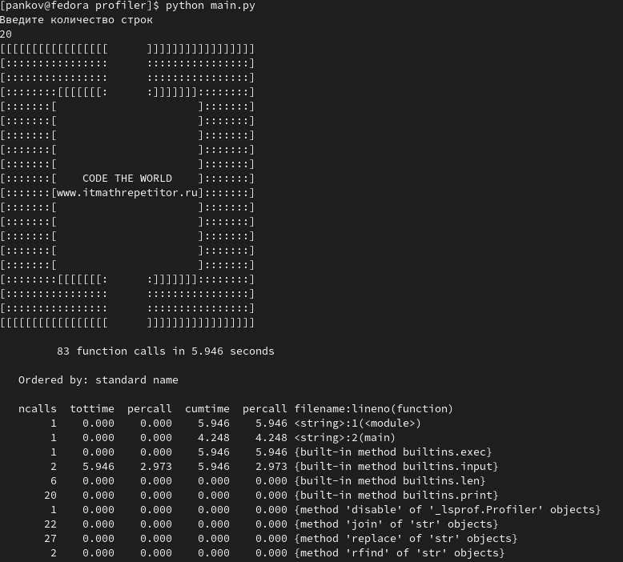

"Узким местом" здесь является ввод, так как программа просто простаивает пока пользователь не введёт данные.
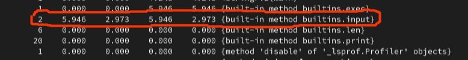

```python
import cProfile
from random import sample

def main():
    try:
        k = int(input(
            "Введите длину пароля(от 8 до 89)\n"))  # 89 Это всего символов, которые участвуют у меня в генерации пароля, символы в пароле не повторяются
        if k < 8:
            raise ValueError
        password = "".join(sample(
            "QWERTYUIOPASDFGHJKLZXCVBNM" \
            "qwertyuiopasdfghjklzxcvbnm" \
            "1234567890!@#$%^&&*(){}[]:|\\/.,<>№;`~", k=k))
        while password.isdecimal() or password.isalpha() or \
                "qwert" in password or "1234" in password or "abc" in password \
                or "567" in password or "789" in password or \
                password.islower() or password.isupper():  # условие которые проверяют на простой пароль
            # генерация занаво если пароль не соответствует требованиям
            password = "".join(sample(
                "QWERTYUIOPASDFGHJKLZXCVBNM" \
                "qwertyuiopasdfghjklzxcvbnm" \
                "1234567890!@#$%^&&*(){}[]:|\\/.,<>№;`~", k=k))
        print("Ваш пароль:", password)
    except ValueError:
        print("Произошла ошибка, перезапустите программу.")

cProfile.run("main()")
```


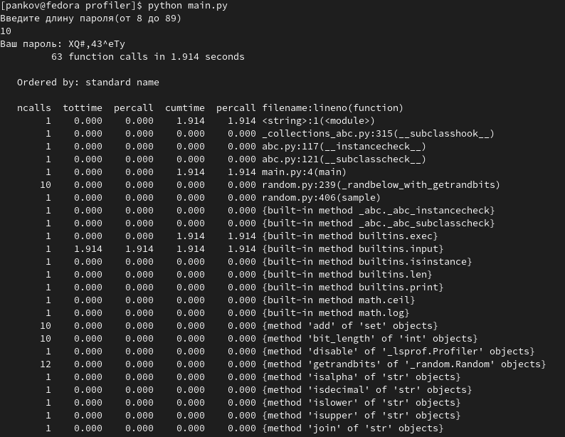
Тут аналогично ввод занимает множество количество времени. Также можно заметить, что библиотека random не очень оптимизирована, а именно вызывает собственные функции(_randbrlow_with_getrandbits), что при незнании может привести к не очень приятным ситуациям.


#### Последняя задача из раздела «Списки» ЛР 5-7.
```python
import cProfile
from random import randint

def main():
    # Функция которая при нахождении элемента массива который делиться возвращает True, если там нет таких элементов то False
    def check_func(array: list) -> bool:
        for el in array:
            if el % 5 == 0:
                return True
        return False

    try:
        N, M = int(input("Введите N\n")), int(input("Введите M\n"))
        if N <= 0 or M <= 0:
            raise Exception
    except Exception:
        print("Произошла ошибка, перезапустите программу.")
    else:
        matrix = [[randint(10, 40) for g in range(M)] for i in range(N)]
        print(*matrix, sep="\n")
        print(*[matrix.index(el) + 1 for el in matrix if check_func(el)], sep=", ")
    # прохожу по каждой строке с условием делимости на 5 с помощью функции check_func

cProfile.run("main()")
```

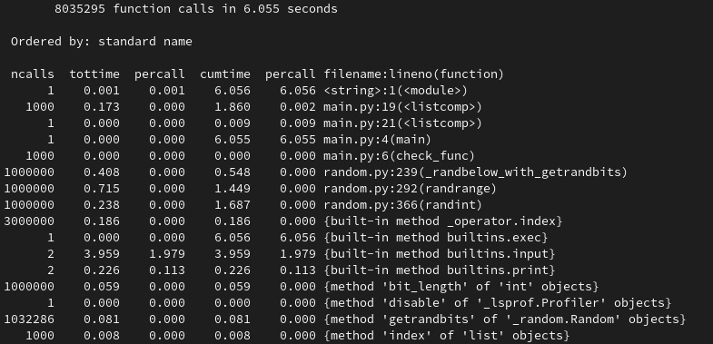

И снова ввод, как бы это не было вторично, занимает всё основное время программы, но тут уже можно заметить, что и на вывод тоже тратить довольно большое количество времени. Ещё можно отметить упомянутую раньше проблему библиотеки случайных чисел random, которая просто внутри randint запускает randrange, который внутри себя вызывает функцию _randbelow_with_getrandbits, что обеспечивает нам не очень хорошее время выполнение этого всего.

#### Последняя задача из раздела «Словари» ЛР 5-7.
```python
import cProfile
from random import randint

def main():
    students = list(range(1, 10))
    students_names = ["Панков", "Гайкин", "Демин", "Летов", "Иванов", "Иванов", "Иванов", "Маратов",
                      "Кузьмов", "Сапогов"]
    students_dict = {el: [students_names[index]] + [randint(2, 5) for i in range(4)] for index, el in
                     enumerate(students)}  # создаю словарь по условию
    print("Словарь:", students_dict)

    [print(val[0], sum(val[1:]) / 4, sep='\t') for val in
     students_dict.values()]  # оформленный вывод

cProfile.run("main(); " * 10000)
```

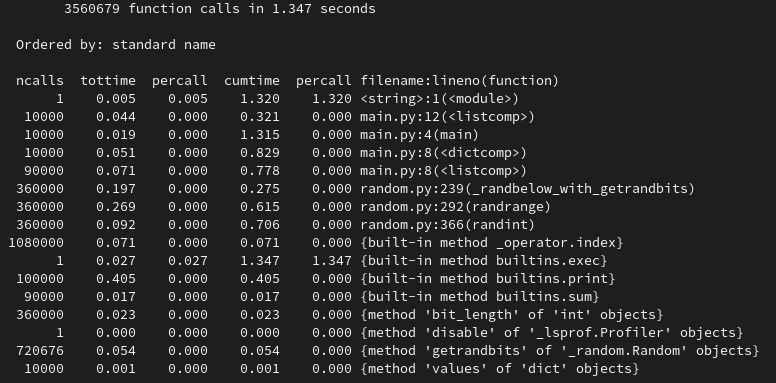

Как можно заметить этот код выполнялся множество раз, чтобы, заметить хоть какие-то изменения, а именно снова проблема с библиотекой random, большое время тратиться на вывод.


#### Второй задачи на классы с наследованием из ЛР 8-10.
```python
import cProfile
import random
# Я решил описать все типы в этом словаре для удобства их добавления, редактирования и изменения, за каждым ключом словаря должно быть оригинальное значение.

transport_types = {None: -1, "car": 0, "motocycle": 1, "boat": 2}
# Также в соответствии с типом есть словарь с default грузоподъёмностью, который используется когда мы не задаём грузоподъёмность самостоятельно.
transport_carrying = {0: 100, 1: 50, 2: 250}


class Transport:
    """Класс транспорт c типом и грузоподъёмностью"""
    t_type = transport_types[None]
    carrying = None

    def __init__(self, t_type: str, carrying: float = None):  # При создании можно указать собственную грузоподъёмность
        try:
            self.t_type = transport_types[t_type]
        except KeyError:
            raise Exception(
                "Такого типа транспорта не существует в нашей программе. Все типы есть в словаре transport_types.")
        if carrying is not None:
            self.carrying = carrying
        else:
            self.carrying = transport_carrying[self.t_type]


class Car(Transport):
    """Класс машина с методом задания и увеличения веса груза"""
    load = 0

    def __init__(self):
        super().__init__("car")  # Вызываем init из Transport

    def set_load(self, load: float) -> bool:  # Задаём вес груза
        if self.carrying < load:
            print("Этот вес груза превышает грузоподъёмность")
            return False
        self.load = load
        return True

    # Метод увеличения веса груза
    def add_load(self, interval: float = 10) -> float:  # Можно задать интервал(по умолчанию 10)
        self.load += interval
        if self.load > self.carrying:
            print("Этот вес груза превышает грузоподъёмность, введите меньший интервал")
            self.load -= interval
        return self.load


def main():
    if input("Введите что-то, если хотите поработать с классами через консоль.\n") != '':
        car = Car()
        print("Объект 'машина' создан.")
        print('Грузоподъёмность машины', car.carrying, "кг")
        try:
            load = float(input("Введите вес груза\n"))
            car.set_load(load)
        except Exception:
            print("Вы ввели неверные значения, вес груза будет равен нулю.")

        while True:
            text = input(
                "Введите интервал повышения веса груза, или ничего если интервал будет по умолчанию, или отрицательное(или ноль) число чтобы прекратить работу с объектом \n")
            if text == '':
                print("Вес груза:", car.add_load(), "кг")
                continue
            if float(text) <= 0:
                break
            print("Вес груза:", car.add_load(float(text)), "кг")
    else:
        car = Car()
        print("Объект 'машина' создан.")
        print('Грузоподъёмность машины', car.carrying, "кг")
        car.set_load(20)
        print("Вес груза:", car.load, "кг")
        load = float(random.randint(0, 20))
        print("Добавляем", load, "кг к грузу")
        print("Вес груза:", car.add_load(load), "кг")

cProfile.run("main()")
```

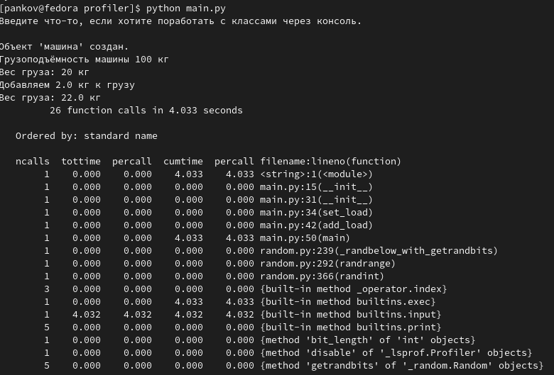

Снова мы можем увидеть, что узким местом является ввод.


### Вторая задача
В задаче на двумерный список вместо генератора использовать цикл с поэлементным добавлением элементов в список. Выполнить профилирование кода. Вычислить по формуле (1) относительную разницу производительности в процентах (сравнить работу генератора и поэлементного добавления в цикле, при необходимости увеличить размерность списка).

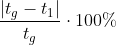

```python
import cProfile
from random import randrange


def main():
    # Функция которая при нахождении элемента массива который делиться возвращает True, если там нет таких элементов то False
    def check_func(array: list) -> bool:
        for el in array:
            if el % 5 == 0:
                return True
        return False

    N, M = 1000, 1000  # int(input("Введите N\n")), int(input("Введите M\n"))
    matrix = [[randrange(10, 40) for g in range(M)] for i in range(N)]
    print(*matrix, sep="\n")
    print(*[matrix.index(el) + 1 for el in matrix if check_func(el)], sep=", ")
    # прохожу по каждой строке с условием делимости на 5 с помощью функции check_func


cProfile.run("main()")
```

Есть модификация программы в randrange(что более эффективно, чем randint) и уже задано количество строк и столбцов

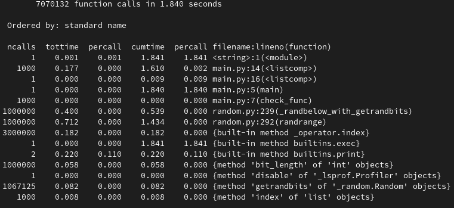

```python
import cProfile
from random import randrange


def main():
    # Функция которая при нахождении элемента массива который делиться возвращает True, если там нет таких элементов то False
    def check_func(array: list) -> bool:
        for el in array:
            if el % 5 == 0:
                return True
        return False

    N, M = 1000, 1000  # int(input("Введите N\n")), int(input("Введите M\n"))
    matrix = []
    for i in range(N):
        matrix.append([])
        for g in range(M):
            matrix[-1].append(randrange(10, 40))
    print(*matrix, sep="\n")
    print(*[matrix.index(el) + 1 for el in matrix if check_func(el)], sep=", ")
    # прохожу по каждой строке с условием делимости на 5 с помощью функции check_func


cProfile.run("main()")
```

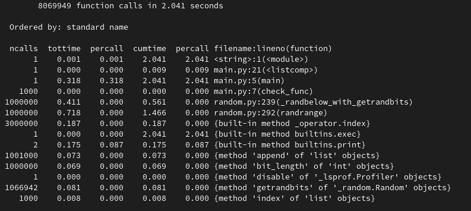


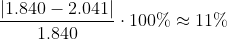

В итоге мы получаем 11%, что довольно интересно, потому что при одинаковом количестве вызове функций random, на них тратится разное количество времени. Также добавляет времени метод списка .append(<value>).
Также мы можем заметить, что узким местом является вывод на который тратится 0.220-0.175 времени.

### Третья задача. Изучить документ «Дополнение к ЛР14-17.docx». Оформить код согласно правилам стиля.

#### Выполнить создание двумерного списка с большим объёмом данных (не менее 10000 элементов). Выполнить профилирование кода.  

```python
import cProfile

cProfile.run("matrix = [[7 for g in range(1000)] for i in range(1000)]")

```

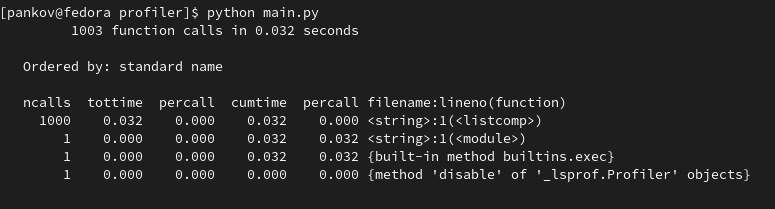
#### Решение задачи с генератором двумерного списка оформить в виде функции, возвращающей список, со входными параметрами в виде числа строк и столбцов. Вызвать функцию несколько раз в основной программе (т.е. сгенерировать несколько списков с одинаковым количеством элементов, но разным значение строк и столбцов). Выполнить профилирование кода.  

```python
import cProfile
from typing import List


# функция, генерирующая матрицу со случайными значениями с заданными строчками и столбцами
def create_list(col: int, row: int) -> List[List[int]]:
    return [[7 for g in range(row)] for i in range(col)]


def main():
    # Генерируем с помощью функций несколько матриц с миллионом элементов
    create_list(100000, 10)
    create_list(1000, 1000)
    create_list(10, 100000)


cProfile.run("main()")

```

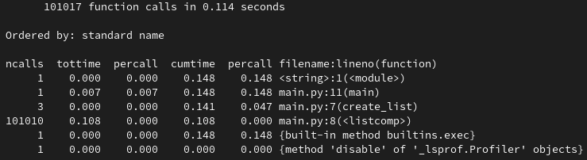

#### Сравнить время на вызов функции (среднее значение по всем вызовам в программе) с временем, полученным для этой задачи в п.1) (вычислить абсолютную разницу значений, ответить на вопрос на сколько уменьшилось/увеличилось время).

0.047 - 0.032 = 0.015 -> время выполнение увеличилось на 0.015, то есть на ~32%.
